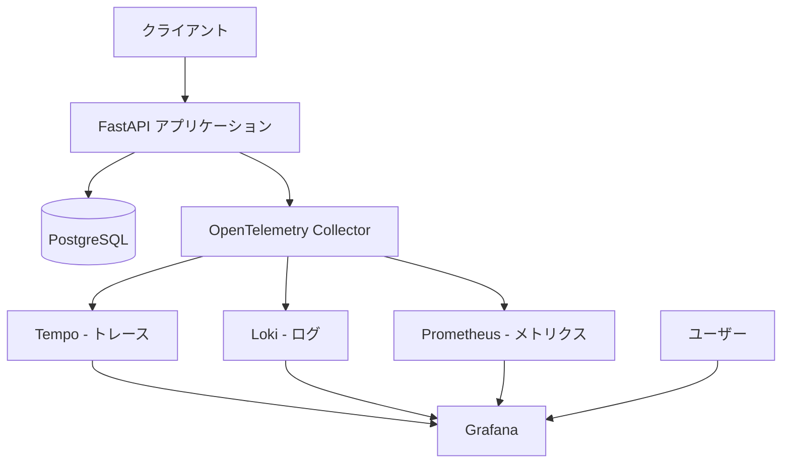

# Todo アプリケーション アーキテクチャ設計

## プロジェクト概要

FastAPI を使用した Todo バックエンドアプリケーションで、完全な観測性（LGTM: Loki, Grafana, Tempo, Mimir/Prometheus）を実装します。

## 技術スタック

### アプリケーション層

- **FastAPI**: Python の高速非同期 Web フレームワーク
- **SQLAlchemy**: ORM（Object-Relational Mapping）
- **Pydantic**: データバリデーション
- **Alembic**: データベースマイグレーション

### データベース

- **PostgreSQL**: リレーショナルデータベース

### 観測性スタック（LGTM）

- **Loki**: ログ集約システム
- **Grafana**: 可視化ダッシュボード
- **Tempo**: 分散トレーシングバックエンド
- **Prometheus**: メトリクス収集・保存

### OpenTelemetry

- **OpenTelemetry Collector**: テレメトリデータ収集・処理
- **OpenTelemetry Python SDK**: アプリケーション計装

## システムアーキテクチャ



## データモデル

### Todo テーブル

| カラム名    | 型           | 制約          | 説明          |
| ----------- | ------------ | ------------- | ------------- |
| id          | UUID         | PRIMARY KEY   | 一意識別子    |
| title       | VARCHAR(200) | NOT NULL      | Todo タイトル |
| description | TEXT         | NULLABLE      | 詳細説明      |
| completed   | BOOLEAN      | DEFAULT FALSE | 完了状態      |
| created_at  | TIMESTAMP    | DEFAULT NOW() | 作成日時      |
| updated_at  | TIMESTAMP    | DEFAULT NOW() | 更新日時      |

## API エンドポイント

### Todo CRUD 操作

| メソッド | エンドポイント     | 説明                  |
| -------- | ------------------ | --------------------- |
| GET      | /api/v1/todos      | 全 Todo 取得          |
| GET      | /api/v1/todos/{id} | 特定 Todo 取得        |
| POST     | /api/v1/todos      | Todo 作成             |
| PUT      | /api/v1/todos/{id} | Todo 更新             |
| DELETE   | /api/v1/todos/{id} | Todo 削除             |
| GET      | /health            | ヘルスチェック        |
| GET      | /metrics           | Prometheus メトリクス |

## OpenTelemetry 計装戦略

### トレース（Traces）

- HTTP リクエスト/レスポンスのトレース
- データベースクエリのトレース
- スパン属性: エンドポイント、HTTP メソッド、ステータスコード
- カスタムスパン: ビジネスロジック処理

### メトリクス（Metrics）

- リクエスト数（カウンター）
- リクエストレイテンシー（ヒストグラム）
- アクティブリクエスト数（ゲージ）
- データベース接続プール状態
- Todo 項目の総数と完了率

### ログ（Logs）

- 構造化ログ（JSON 形式）
- ログレベル: DEBUG, INFO, WARNING, ERROR, CRITICAL
- コンテキスト情報: trace_id, span_id, リクエストパス
- エラースタックトレース

## プロジェクト構造

```
hello-otel/
├── app/
│   ├── __init__.py
│   ├── main.py                 # FastAPIアプリケーションエントリーポイント
│   ├── config.py               # 設定管理
│   ├── database.py             # データベース接続
│   ├── models/
│   │   ├── __init__.py
│   │   └── todo.py             # SQLAlchemyモデル
│   ├── schemas/
│   │   ├── __init__.py
│   │   └── todo.py             # Pydanticスキーマ
│   ├── routers/
│   │   ├── __init__.py
│   │   └── todos.py            # Todoエンドポイント
│   ├── services/
│   │   ├── __init__.py
│   │   └── todo_service.py     # ビジネスロジック
│   └── observability/
│       ├── __init__.py
│       ├── tracing.py          # トレース設定
│       ├── metrics.py          # メトリクス設定
│       └── logging.py          # ログ設定
├── alembic/
│   ├── versions/               # マイグレーションファイル
│   └── env.py
├── grafana/
│   ├── datasources/
│   │   └── datasources.yml     # データソース設定
│   └── dashboards/
│       └── todo-app.json       # Todoアプリダッシュボード
├── otel-collector/
│   └── config.yaml             # OTel Collector設定
├── docker-compose.yml          # Docker Compose設定
├── Dockerfile                  # アプリケーションDockerfile
├── requirements.txt            # Python依存関係
├── alembic.ini                 # Alembic設定
├── .env.example                # 環境変数テンプレート
└── README.md                   # セットアップ手順
```

## Docker Compose サービス構成

### 1. app（FastAPI アプリケーション）

- ポート: 8000
- 依存: PostgreSQL, OTel Collector

### 2. postgres（PostgreSQL）

- ポート: 5432
- ボリューム: 永続化

### 3. otel-collector（OpenTelemetry Collector）

- ポート: 4317（gRPC）, 4318（HTTP）
- 設定: レシーバー、プロセッサー、エクスポーター

### 4. tempo（分散トレーシング）

- ポート: 3200, 4317
- ストレージ: ローカルファイル

### 5. loki（ログ集約）

- ポート: 3100
- ストレージ: ローカルファイル

### 6. prometheus（メトリクス）

- ポート: 9090
- スクレイプ設定: FastAPI /metrics

### 7. grafana（可視化）

- ポート: 3000
- データソース: Tempo, Loki, Prometheus
- ダッシュボード: プリセット

## 観測性ダッシュボード設計

### Grafana ダッシュボード構成

#### 1. 概要パネル

- リクエスト総数（24 時間）
- 平均レスポンスタイム
- エラーレート
- Todo 総数と完了率

#### 2. トレースパネル

- レイテンシー分布
- エンドポイント別レスポンスタイム
- トレースフロー可視化

#### 3. メトリクスパネル

- HTTP リクエストレート
- レスポンスタイムヒストグラム
- データベースクエリ時間

#### 4. ログパネル

- エラーログ一覧
- ログレベル別集計
- トレース ID によるログフィルタリング

## セキュリティ考慮事項

- 環境変数による機密情報管理
- データベース接続文字列の保護
- CORS 設定
- SQL インジェクション対策（SQLAlchemy ORM 使用）

## パフォーマンス最適化

- 非同期データベース操作（asyncpg）
- 接続プーリング
- インデックス設定
- クエリ最適化

## 開発・運用フロー

1. ローカル開発: `docker-compose up`
2. データベースマイグレーション: `alembic upgrade head`
3. アプリケーション起動: FastAPI が自動起動
4. Grafana 確認: http://localhost:3000
5. API 動作確認: http://localhost:8000/docs

## 拡張性

今後の拡張に備えた設計:

- ユーザー認証追加可能な構造
- マイクロサービス化への対応
- キャッシュ層追加（Redis）
- メッセージキュー統合（RabbitMQ/Kafka）

## 監視・アラート戦略

### アラート条件案

- エラーレート > 5%
- 平均レスポンスタイム > 1 秒
- データベース接続エラー
- メモリ使用率 > 80%

## まとめ

このアーキテクチャは、シンプルな Todo CRUD アプリケーションに完全な観測性を提供します。OpenTelemetry による標準化されたテレメトリデータ収集と、LGTM スタックによる包括的な可視化により、本番環境でのトラブルシューティングとパフォーマンス最適化が容易になります。
