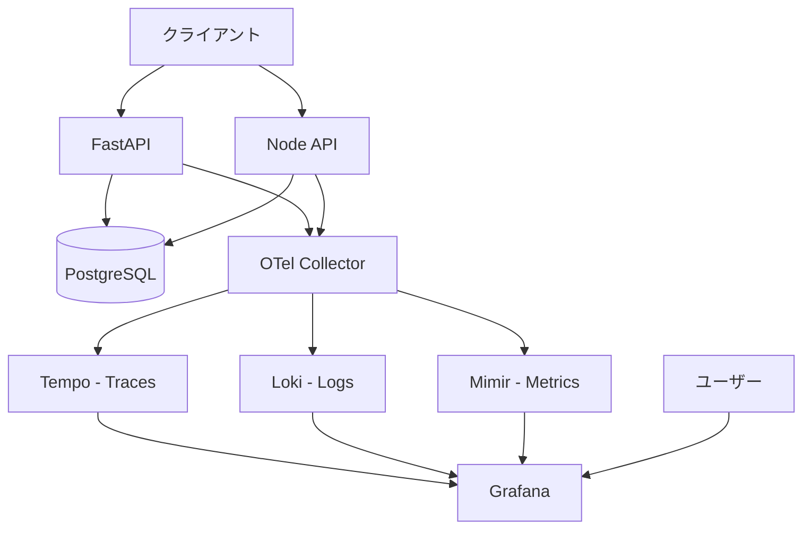

# Todo アプリケーション アーキテクチャ（最終版）

本ドキュメントは初期設計と最終構成を統合し、最新のシンプル構成を示します。

## サマリ
- FastAPI (Python) + Node/Express (TypeScript) が同じ Postgres を共有
- 観測基盤は Grafana OTEL-LGTM（Tempo/Loki/Mimir/Grafana）＋ Collector（spanmetrics）
- docker-compose で最小サービス構成（app, node-api, postgres, lgtm, collector）

## 技術スタック
- アプリ: FastAPI / Express + Prisma
- DB: PostgreSQL
- 観測性: OpenTelemetry + Grafana OTEL-LGTM + Collector(spanmetrics)
- Python 依存管理: uv

## システム構成（最終）
```
5サービス: app, node-api, postgres, collector, lgtm (all-in-one)
```
- app: FastAPI
- node-api: Express + TypeScript + Prisma
- postgres: DB
- collector: spanmetrics connector 付き OTEL Collector
- lgtm: Grafana/Tempo/Loki/Mimir 一体型

## アーキ図（概念）


## データモデル（Todo）
| カラム名    | 型           | 制約          | 説明          |
| ----------- | ------------ | ------------- | ------------- |
| id          | UUID         | PRIMARY KEY   | 一意識別子    |
| title       | VARCHAR(200) | NOT NULL      | Todo タイトル |
| description | TEXT         | NULLABLE      | 詳細説明      |
| completed   | BOOLEAN      | DEFAULT FALSE | 完了状態      |
| created_at  | TIMESTAMP    | DEFAULT NOW() | 作成日時      |
| updated_at  | TIMESTAMP    | DEFAULT NOW() | 更新日時      |

## API エンドポイント（共通）
| メソッド | エンドポイント     | 説明                  |
| -------- | ------------------ | --------------------- |
| GET      | /api/v1/todos      | 全 Todo 取得          |
| GET      | /api/v1/todos/{id} | 特定 Todo 取得        |
| POST     | /api/v1/todos      | Todo 作成             |
| PUT      | /api/v1/todos/{id} | Todo 更新             |
| DELETE   | /api/v1/todos/{id} | Todo 削除             |
| GET      | /health            | ヘルスチェック        |

## OpenTelemetry 戦略
### トレース
- HTTP リクエスト/レスポンス
- DB クエリ
- スパン属性: メソッド/ルート/ステータス

### メトリクス
- http.server.duration (レイテンシ分布)
- http.server.active_requests
- spanmetrics (ルート別レート/レイテンシ)
- DB 接続プール

### ログ
- 構造化ログ（trace_id/span_id 付き）
- アプリ stdout を OTLP で Collector へ

## プロジェクト構造（サマリ）
```
hello-otel/
├── python-app/      # FastAPI 実装
├── node-app/        # Express + TypeScript + Prisma 実装
├── collector.yaml   # spanmetrics 用 Collector 設定
├── docker-compose.yml
└── docs/            # このドキュメント群
```

## Docker Compose サービス
- app: 8000/tcp, 依存 postgres/lgtm/collector
- node-api: 3001/tcp, 依存 postgres/lgtm/collector
- postgres: 5432/tcp, volume 永続化
- collector: 4317(gRPC)/4318(HTTP), spanmetrics connector
- lgtm: 3000(Grafana)/4317/4318

## 観測性ダッシュボードのポイント
- トレース: Tempo でエンドポイント/レイテンシ確認
- ログ: Loki で `{service_name=