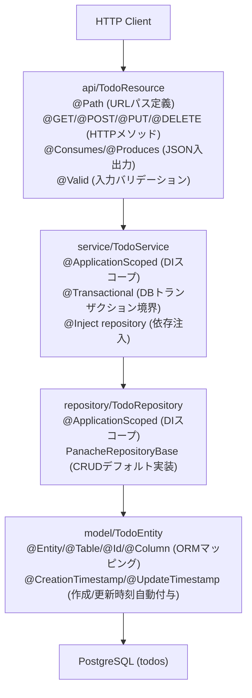

# Quarkus Todo API

Quarkus (RESTEasy Reactive + Hibernate ORM) 版 Todo API です。既存の PostgreSQL `todos` テーブルをそのまま利用します（マイグレーション不要）。Java 21 で動作確認しています。

## 全体像（パッケージ/ルーティング/DI と主要アノテーション）

Resource → Service → Repository → Entity で PostgreSQL に到達し、Bean Validation が DTO を検証、例外ハンドラが 400/422 を整形します。エントリポイントやルーターは Quarkus がビルド時に生成し、設定は `application.properties` に集約されています。



- 例外ハンドラ: `exception/*Mapper` (@Provider 実装で 400/422 を整形)。
- DTO: `CreateTodoRequest` / `UpdateTodoRequest` / `TodoResponse` は `record` + Bean Validation（`@NotBlank`, `@Size` など）。
- Health: `api/HealthResource` (@Path("/health"), @NonBlocking) で疎通確認。
- Bean Validation: フィールドに制約アノテーションを付けるとリクエスト受信時に自動検証し、違反時は 400。
- @Provider: JAX-RS の拡張ポイント登録用アノテーション。ExceptionMapper などに付けると例外を横取りしてカスタムレスポンスを返せる。

### 用語の整理（JAX-RS / CDI / Panache / Hibernate）
- JAX-RS: REST API を定義する Jakarta EE 標準仕様（`@Path`, `@GET/@POST/@PUT/@DELETE`, `@Consumes`, `@Produces`, `@PathParam`, `@QueryParam` など）。
- Quarkus REST: 旧称 RESTEasy Reactive。上記 JAX-RS アノテーションを解釈する Quarkus 標準 REST スタック。
- CDI: Jakarta EE の DI 仕様。`@Inject` で依存注入し、`@ApplicationScoped` などのスコープでライフサイクルを管理。Quarkus では Arc が実装。
- Arc: Quarkus の CDI 実装（軽量・ビルド時最適化版）。起動前に Bean を解析して高速化し、ネイティブイメージでも動くように設計されている。
- Bean: CDI コンテナ（Arc）が管理するオブジェクトの単位。DI 対象となり、スコープ（例: `@ApplicationScoped`）やライフサイクルがコンテナにより制御される。
- Panache: Quarkus が提供する Hibernate ORM の薄いラッパー。`PanacheRepositoryBase` を実装するだけで `persist`, `find`, `list`, `delete` などの CRUD ヘルパーが使える（ActiveRecord スタイルも選択可）。
- Hibernate ORM: Red Hat 主導の JPA 実装。エンティティ（`@Entity`, `@Id`, `@Column`）とテーブルをマッピングし、JPQL/HQL/ネイティブ SQL を扱う。Panache はこれを使いやすく包んだ Quarkus 拡張。

## 前提と環境変数

```bash
cd quarkus-app
cp .env.example .env
```

`.env` の主なキー: `PORT`, `DATABASE_*`, `OTEL_EXPORTER_OTLP_ENDPOINT`, `OTEL_SERVICE_NAME` など。

## ビルドと起動

### 開発/ローカル（JVM）
```bash
# 依存解決とビルド（JVM ランナー）
mvn -B -DskipTests package

# アプリ起動（JVM ランナー）
PORT=8081 DATABASE_JDBC_URL=jdbc:postgresql://localhost:5432/tododb \
DATABASE_USERNAME=todouser DATABASE_PASSWORD=todopass \
OTEL_EXPORTER_OTLP_ENDPOINT=http://localhost:4317 \
OTEL_SERVICE_NAME=todo-api-quarkus \
java -jar target/*-runner.jar

# 開発モード（ホットリロード）
mvn quarkus:dev
# ポート変更は -Dquarkus.http.port=8081 などで上書き
```

### ネイティブイメージ + コンテナ（compose で利用する想定）
```bash
mvn -DskipTests \
  -Dquarkus.package.type=native \
  -Dquarkus.native.container-build=true \
  -Dquarkus.container-image.build=true \
  -Dquarkus.container-image.builder=docker \
  -Dquarkus.container-image.registry=localhost \
  -Dquarkus.container-image.group=todogroup \
  -Dquarkus.container-image.name=todo-api-quarkus \
  -Dquarkus.container-image.tag=native \
  package

# docker-compose から起動（上のビルド後）
docker-compose up -d quarkus-api
```

### Dockerfile の使い分け（流れに沿って）
- `src/main/docker/Dockerfile.native`: 上記の `quarkus.package.type=native` ビルドで自動使用。compose もこのネイティブイメージを参照。
- `src/main/docker/Dockerfile.jvm`: `quarkus.package.type=jar` のときのデフォルト。
- ルートの `Dockerfile`: 手書きマルチステージ。Quarkus 拡張を使わず自前ビルドしたいときだけ利用。

## API エンドポイント

- `GET /health`
- `GET /api/v1/todos?skip=0&limit=100`
- `GET /api/v1/todos/{id}`
- `POST /api/v1/todos`
- `PUT /api/v1/todos/{id}`
- `DELETE /api/v1/todos/{id}`

リクエスト/レスポンスのキーは `snake_case`（例: `created_at`）です。

## テスト

```bash
mvn test
```
